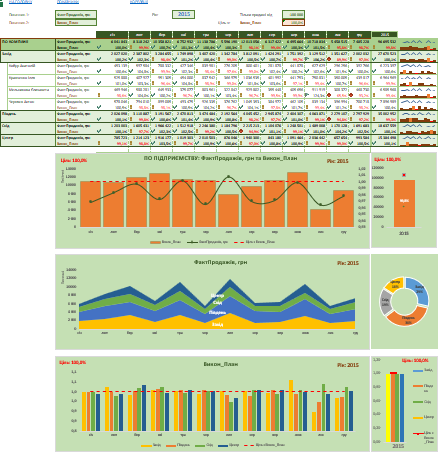
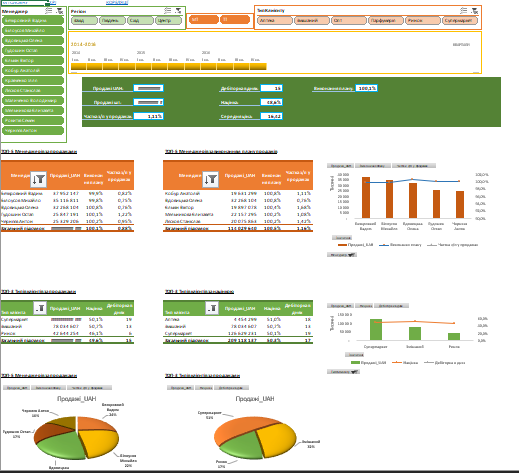
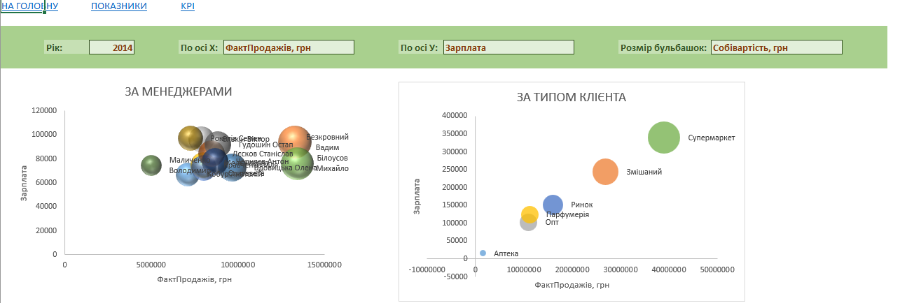

# Excel Business Analytics & Forecasting Project

## 📊 Опис проєкту

Цей курсовий проєкт реалізує повноцінну аналітичну систему в MS Excel для компанії, яка займається продажами. Проєкт охоплює підключення до зовнішніх джерел даних, трансформацію, розрахунок ключових показників ефективності (KPI), а також створення інтерактивних дашбордів і звітів.

## 🧩 Основні компоненти

- **Джерела даних:**
  - База Access або Excel-файл з фактичними продажами.
  - Excel-файли з планами продажів по менеджерах.
  - Текстовий файл з дебіторською заборгованістю.
  - Excel-файл із зарплатами та бонусами менеджерів.

- **Інструменти Excel:**
  - Power Query (імпорт та підготовка даних).
  - SUMIFS, IF, VLOOKUP, INDEX+MATCH.
  - Зведені таблиці та зрізи.
  - Діаграми, спарклайни, умовне форматування.
  - Гіперпосилання, захист аркушів, приховання службових даних.

## ✅ Реалізовані модулі

### I. Обробка та трансформація даних
- Імпорт та об’єднання даних з різних джерел.
- Агрегація продажів до рівня: рік-місяць-регіон-менеджер-тип клієнта.
- Створення загальної таблиці для подальшого аналізу.

### II. Розрахунок зарплат і бонусів
- Пропорційний розподіл зарплат та бонусів за типами клієнтів.
- Визначення бонусів за виконання плану та низьку дебіторську заборгованість.

### III. KPI Dashboard
- Аналіз виконання трьох цілей:
  - План продажів
  - Середня ціна
  - Націнка
- Вибір показників, років та фільтрація за сумами продажів.
- Динамічні діаграми з автоматичною назвою, умовним форматуванням, спарклайнами та індикаторами виконання цілей.

### IV. Dashboard на базі зведених таблиць
- Аналіз показників по регіонах, менеджерах, форматах роздрібу.
- Top-менеджери та клієнти по KPI.
- Повна інтеграція з роздільниками та часовою шкалою.

### V. Кореляційний звіт
- Аналіз взаємозв’язків між будь-якими трьома показниками у вигляді бульбашкових діаграм.
- Можливість вибору року та розміру бульбашок.

### VI. Фіналізація
- Меню навігації між звітами.
- Захист і приховання службових аркушів.
- Зручний інтерфейс для кінцевого користувача.

## 📂 Структура репозиторію

```
📁 data/                # Вихідні дані (Access, Excel, .txt)
📁 screenshots/         # Приклади вигляду звітів
📄 Project_Dashboard.xlsx     # Основний файл проєкту
📄 README.md            # Документація
```

## 🛠 Технічні вимоги

- Microsoft Excel 2016+ з підтримкою Power Query
- ОС Windows (для роботи з Access, рекомендовано)
- Досвід користування Excel: середній-рівень (просунутий вітається)

## 🧠 Ключові навички

- Excel-аналітика: формули, умовне форматування, зведені таблиці
- Бізнес-аналіз: робота з KPI, дебіторкою, планування
- Power Query: ETL-процеси в Excel

## 📸 Приклад дашборду

Нижче наведено кілька прикладів дашбордів, реалізованих у рамках проєкту:


_Основний KPI дашборд з розкривними списками, діаграмами та умовним форматуванням._


_Звіт на основі зведених таблиць з топ-менеджерами та клієнтами._


_Звіт з бульбашковими діаграмами для аналізу кореляцій між показниками._

📝 Авторка
[Вишневська Ірина]